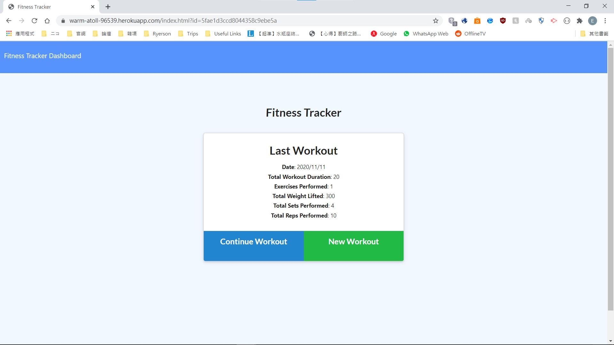
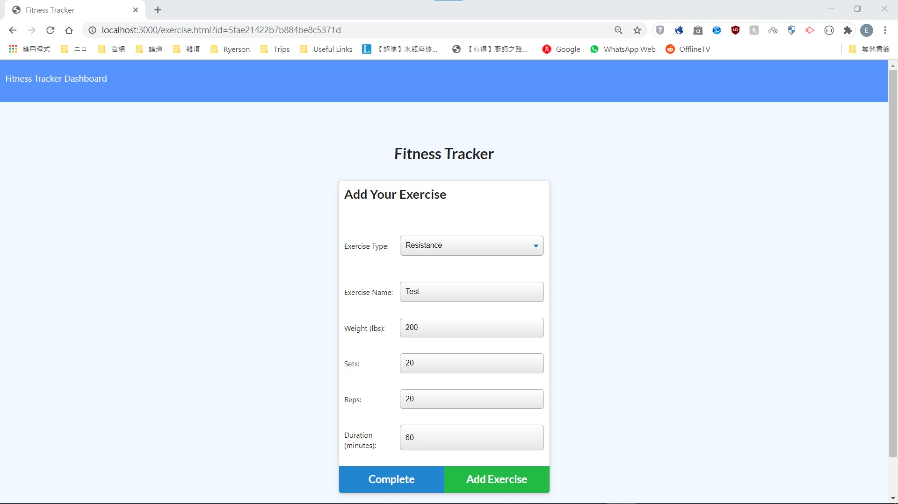
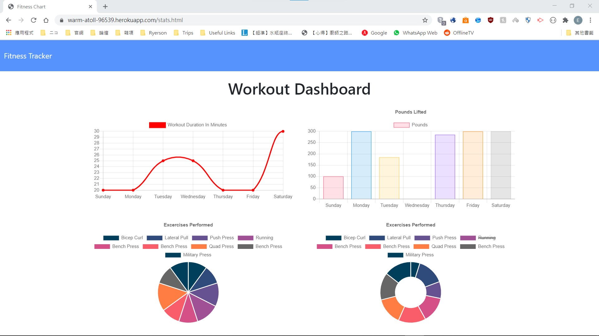

# Workout-Tracker
Goal: To make a workout tracker that is able keep record of your past workouts and tabluate the data 
This project has the following abilities:
- Able to view your last workout and its data, i.e. total duration/weight/reps, etc
- Able to create new workout and add new exercises to that workout
- Able to continue last workout and add new exercises to that workout
- Able to see the data of workouts within the past 7 days as charts

 

This project has the following files: 
- server.js: uses **express.js** to serve contents with the *public* folder as well as hosting routes for API calls
- package.json: contains basic info of the tracker as well as all the packages used in this project
- orm.mongoose.js: initiate connection with **MongoDB** and functions for interacting with the database
- models/index.js: for reading all the model JS files in the *models* folder
- models/Workout.js: contains data structure for the schema of the database
- public folder: contains client facing *HTML*, *JavaScript* and *CSS* files
- api_routes.js: contains endpoints for API call to interact with the database
- seed.js: test entries of the database fo the project

 

This project was made using: **HTML5**, **JavaScript**, **CSS**, **NodeJS**, **ExpressJS**, **Mongoose** and **MongoDB**. 
This project is currently hosted on Heroku with the use of MongoDB Atlas: https://warm-atoll-96539.herokuapp.com/index.html?id=5fae1d3ccd8044358c9ebe5a 

## index.html

## Adding new exercise to new/last workout

## Data of past workouts
